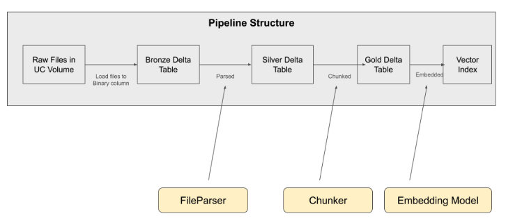

# Cookbook: Advanced Data Pipeline

**Note: This is an early preview release.  Expect instability and bugs.**

Customers need to try different chunking & parsing strategies, alongside different embedding models.

The goal of this cookbook is to provide a RAG data processing pipeline that provides a set of pre-baked chunking & parsing strategies + embedding models, yet is flexible enough for customers to plug in their own custom techniques.  

It is intended for experimentation vs. as a production artifact.  A future release will provide a paved path from a working configuration to a production ready pipeline.

0. Start a single user cluster with MLR/DBR 14.3 or MLR/DBR 15.0.
    - Some parsing and chunking strategies use models that require GPU support.
1. Open [00_start_here_rag_data_pipeline](00_start_here_rag_data_pipeline.py)
2. Define a `pipeline_configuration` to select:
    - 1 parsing strategy for each type of file
    - 1 chunking strategy 
    - Optionally, a different chunking strategy for each type of file
    - 1 embedding model
3. Press Run All 
4. A vector index and RAG Studio configuration compatible with the other Cookbook examples is produced

Configuration is compatible with:
- [PDF Bot w/ single-turn conversation](../A_pdf_rag_with_single_turn_chat/README.md)
- [PDF Bot w/ multi-turn conversation](..//B_pdf_rag_with_multi_turn_chat/README.md)



## Example configuration

```
# Embedding model is defined here b/c it is used in multiple places inside the `pipeline_configuration`
embedding_model = "BAAI/bge-large-en-v1.5"

pipeline_configuration = {
    # Short name of this configuration
    # Used as a postfix to identify the resulting Delta Tables e.g., `{uc_volume_name}_{tag}_gold`
    "tag": "gte_7500",
    # Embedding model to use for embedding the chunks
    "embedding_model": {
        # model serving endpoint
        "endpoint": "databricks-bge-large-en",
        # name of the embedding model (maps to `embedding_model_configs`)
        "model_name": embedding_model,
    },
    # Parsing strategies that turn a raw document into a string
    # Each strategy must be a FileParser class defined in `parse_chunk_functions`
    "parsing_strategy": {
        "html": HTMLToMarkdownify(),
        "pdf": UnstructuredPDF(strategy="fast"),
        "pptx": UnstructuredPPTX(),
        "docx": PyPandocDocx(),
        "md": PassThroughNoParsing(),
    },
    # Chunking strategies that turned a parsed document into embeddable chunks
    # Each strategy must be a Chunker class defined in `parse_chunk_functions`
    # `default` will be used for any file extension with a defined strategy.
    "chunking_strategy": {
        "default": RecursiveTextSplitterByTokens(
            embedding_model_name=embedding_model,
            chunk_size_tokens=450,
            chunk_overlap_tokens=50,
        ),
        "md": MarkdownHeaderSplitter(),
    },
}
```

## Configuration options

### Embedding models

Note: OpenAI models have not been extensively tested.

| Key                                  | Context Window |  Notes      |
|--------------------------------------|----------------|--------|
| Alibaba-NLP/gte-large-en-v1.5        | 8192           |     Requires deploying the model to GPU Model Serving using this [notebook](helpers/SentenceTransformer_Embedding_Model_Loader.py)  |
| nomic-ai/nomic-embed-text-v1         | 8192           |   Requires deploying the model to GPU Model Serving using this [notebook](helpers/SentenceTransformer_Embedding_Model_Loader.py)     |
| BAAI/bge-large-en-v1.5               | 512            |    Available as `databricks-bge-large-en` on FMAPI    |
| text-embedding-ada-002               | 8192           |     Requires setting up an external model using this [notebook](helpers/Create_OpenAI_External_Model.py)   |
| text-embedding-3-small               | 8192           |   Requires setting up an external model using this [notebook](helpers/Create_OpenAI_External_Model.py)     |
| text-embedding-3-large               | 8192           |    Requires setting up an external model using this [notebook](helpers/Create_OpenAI_External_Model.py)    |

### File parsers

To view the complete set of parameters for a strategy or modify how it is implemented, search for the strategy inside the [parse_chunk_functions.py](parse_chunk_functions.py) notebook.

| Strategy                     | Params | Description                                  | Supported File Extensions    |
|------------------------------|--------|----------------------------------------------|------------------------------|
| `HTMLToMarkdownify()`          | None   | Converts HTML content to Markdown format.    | `.html`                      |
| `PassThroughNoParsing()`       | None   | Returns the input without any parsing.       | `.md`, `.txt`, `.html`                          |
| `PyMuPdfMarkdown()`            | None   | Converts PDF content to Markdown using PyMuPDF. | `.pdf`                     |
| `PyMuPdf()`                    | None   | Extracts text from PDF files using PyMuPDF.  | `.pdf`                       |
| `PyPdf()`                      | None   | Extracts text from PDF files using PyPDF.    | `.pdf`                       |
| `UnstructuredPDF()`            | [insert here]   | Handles PDF files that lack a clear structure. | `.pdf`                     |
| `PyPandocDocx()`               | None   | Converts DOCX files using Pandoc.            | `.docx`                      |
| `UnstructuredDocX()`           | None   | Manages DOCX files with unstructured content.| `.docx`                      |
| `UnstructuredPPTX()`           | None   | Manages PPTX files with unstructured content.| `.pptx`                      |


### Available chunkers

To view the complete set of parameters for a strategy or modify how it is implemented, search for the strategy inside the [parse_chunk_functions.py](parse_chunk_functions.py) notebook.

| Strategy                     | Params | Description                                  | Supported File Extensions    |
|------------------------------|--------|----------------------------------------------|------------------------------|
| `RecursiveTextSplitterByTokens()` | [insert here]   | Splits texts into chunks based on token count. | Any                      |
| `MarkdownHeaderSplitter()`     | [insert here] | Split texts based on Markdown headers | Any |

